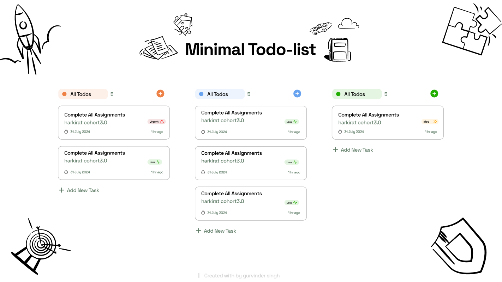

# Taskify

A minimalistic Todo List application that allows users to manage their tasks efficiently with a simple and clean user interface.

## Thought Process

The goal of Taskyfy was to create a straightforward and user-friendly todo application that allows users to add, manage, and organize their tasks with minimal effort. The application supports a drag-and-drop feature for task management, enabling users to easily move tasks between different states (In Progress, Completed) without any complex interactions.

## Screenshots

*(Add your actual screenshot path)*

## How to Use

1. **Adding Tasks:**
   - Click on the **Add This Todo** button.
   - Enter the task name and select the priority.
   - Click **Add This Todo** to add the task to the "In Progress" list.

2. **Managing Tasks:**
   - You can drag and drop tasks between "In Progress" and "Completed" sections.
   - Tasks will automatically update their count in each category.

3. **Editing Tasks:**
   - Currently, editing tasks directly is not implemented. You can remove tasks and add them again if needed.

## Sources

- **Drag and Drop:** [MDN Web Docs - Drag and Drop API](https://developer.mozilla.org/en-US/docs/Web/API/HTML_Drag_and_Drop_API)
- **Design Inspiration:** [Notion](https://www.notion.so/)

## Thanks to Cohort

A special thanks to my cohort for their support and collaboration throughout the development of this project. Your feedback and insights were invaluable in bringing Taskyfy to life!

